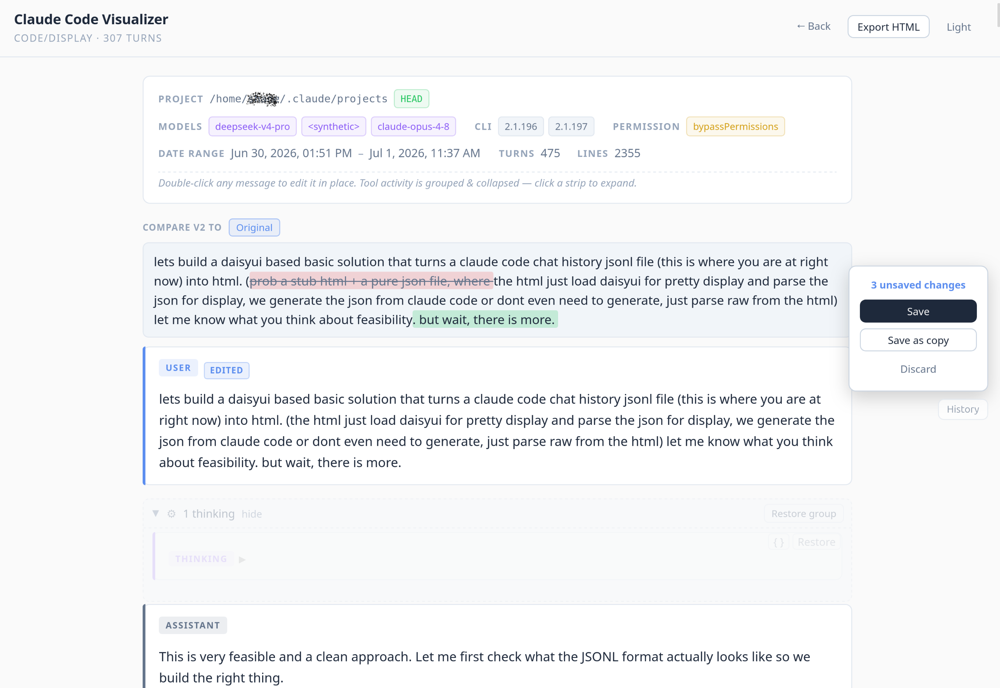

# Claude Code Studio

A desktop app for browsing and editing your [Claude Code](https://claude.com/claude-code) chat history — fully offline.

**Your conversations never leave your machine.** No server, no upload, no telemetry. Claude Code Studio reads the session files Claude Code already saves on your computer and turns them into clean, readable conversations you can browse, edit, and back up. Open source, MIT licensed.



## What it does

- **Reads your whole history.** Auto-discovers every Claude Code session on launch and groups them by project. Each card shows the models used, turn count, size, and date range at a glance.
- **Renders conversations beautifully.** Markdown messages, collapsible thinking, tool calls and results, and nested subagent threads — laid out to read like a clean chat instead of raw JSON.
- **Lets you edit in place.** The view *is* the editor: double-click any message to change it, flip who said it, reorder, or delete. Tool activity folds away by default so you just see the conversation.
- **Keeps every version.** Each edit is tracked with a word-level diff and full history, so you can compare or roll back any message.
- **Resumes where you left off.** Jump back into `claude --resume` for any session in one click, or fork from any single message to branch off a new session from that point.
- **Never loses your work.** Edits auto-save as you type, every save is backed up first, and you can restore an earlier backup in one click.
- **Stays out of the cloud.** Everything happens on your local filesystem. The only network it ever touches is checking for its own updates.
- **Updates itself.** New versions download and install automatically — no reinstalling by hand.

## Install

Download the installer for your platform from the [Releases page](https://github.com/zhangxingeng/claude-code-studio/releases):

| Platform | Files |
|----------|-------|
| Windows  | `.exe` or `.msi` |
| macOS    | `.dmg` (Apple Silicon and Intel) |
| Linux    | `.AppImage` or `.deb` |

### First launch (unsigned builds)

These builds aren't code-signed — certificates are a paid, per-platform expense — so your OS may warn you the first time you open the app:

- **Windows** — SmartScreen: click **More info** → **Run anyway**.
- **macOS** — Right-click the app → **Open** → confirm (or System Settings → Privacy & Security → Open Anyway).
- **Linux** — For the AppImage, run `chmod +x <file>.AppImage` first.

## Build from source

Requires [Node.js](https://nodejs.org), [Rust](https://rust-lang.org), and the [Tauri v2 prerequisites](https://tauri.app/start/prerequisites/) for your OS.

```bash
pnpm install
pnpm tauri build
```

Curious how it works or want to contribute? See [ARCHITECTURE.md](ARCHITECTURE.md).

## License

MIT
